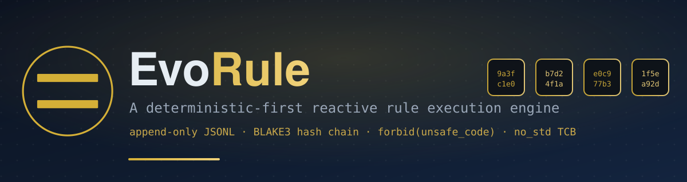

# EvoRule — A deterministic-first reactive rule execution engine



[](https://github.com/evorule/evorule/actions/workflows/ci.yml)
[](https://gitee.com/evorule/evorule/stargazers)
[](CHANGELOG.md)
[](LICENSE)
[](#testing--verification)
[](#formal-verification)
[](#evorule-tcb--minimal-trusted-computing-base)

> **Determinism is first-class**: same input → same output. No randomness, no time dependence, no implicit state.
> Every execution trace is persisted append-only as JSONL; a BLAKE3 hash chain makes it auditable, replayable, and tamper-evident.

**Language / 语言**: [English](#english) · [中文 / Chinese](#chinese)

---

<a id="english"></a>

## Experience & Navigation

- **Online console (no install)**: [evorule-console-cloud live demo](https://evorule.github.io/evorule-console-cloud/)
- **evorule-server** — HTTP API / SSE / debug control / I/O Handler (application layer): [Gitee](https://gitee.com/evorule/evorule-server) ｜ [GitHub](https://github.com/evorule/evorule-server)
- **evorule-console-cloud** — governance & audit console (web frontend): [Gitee](https://gitee.com/evorule/evorule-console-cloud) ｜ [GitHub](https://github.com/evorule/evorule-console-cloud)
- **Organization home**: [Gitee @evorule](https://gitee.com/evorule) ｜ [GitHub @evorule](https://github.com/evorule)

---

## Highlights of the current release (v0.4.2)

- **Slimmer Stable fact**: carries only the `version` number, not a full payload snapshot; WAL volume for long-lived sessions is O(n). Code: `evorule-reactor/src/fact.rs:228-242`
- **Meta-instruction SSOT**: the tcb exports the authoritative `META_INSTRUCTION_TYPES` constant (6 types); the cli `validate` references it. Code: `evorule-tcb/src/executor.rs:52-59`; test: `test_meta_instruction_types_ssot`
- **WAL failure escalation**: 3 consecutive WAL write failures auto-terminate the session (fail-closed). Code: `evorule-reactor/src/facts_log.rs` (`WAL_FAIL_TERMINATE_THRESHOLD=3`)
- **Hash-chain SSOT**: the BLAKE3 algorithm lives in the reactor and is re-exported by governance/cli; the three-way `cross_validate` agrees. Code: `evorule-reactor/src/hash.rs`; test: `test_three_way_hash_consistency`
- **Full suite 758 passed / 0 failed** (`cargo test --workspace --features persistence`, EXIT=0, measured 2026-09-05)

---

## Core features

| Feature | Status | Description | Evidence anchor |
|---|---|---|---|
| Deterministic execution | ✅ | `JsonValue` has no Float, BTreeMap ordered, BLAKE3, no randomness/time dependence, explicit serialization | Code: `evorule-tcb/src/value.rs`; test: `deterministic_same_input_same_output` |
| Auditable provenance | ✅ | All Facts append-only JSONL + BLAKE3 hash chain + WAL persistence | Code: `evorule-reactor/src/facts_log.rs`, `hash.rs`; test: `test_three_way_hash_consistency` |
| No silent pass-through | ✅ | Ignored instruction → explicit Error fact; 3 consecutive WAL failures → session terminated; fail-closed | Code: `evorule-reactor/src/reactor.rs`; test: `test_wal_consecutive_failure_escalates_with_guidance` |
| Time machine | ✅ | replay / rewind / fork / diff (implemented in the **governance** layer) | Code: `evorule-governance/src/time_machine.rs`; tests: `test_rewind_basic_state_transition` and 15 more |
| Tamper detection | ✅ | All three tamper classes (content / chain_hash / prev_hash) are detected | Tests: `test_tier2_detects_content_tamper` and others |
| Debug queries | ✅ | phase / queue / pending_io / snapshot queries (implemented by evorule-server) | Code: `evorule-reactor/src/reactor.rs` ReactorHandle API |
| Pseudo single-step replay | ✅ | `step` is a rewind-based replay (not a real single step); `pause` suspends SSE polling (not reactor execution) | Code: evorule-server application layer |
| Multi-session isolation | ✅ | session management + WAL sharding + cross-session causal-chain tracking | Code: `evorule-governance/src/session.rs`; test: `concurrent_sessions_state_isolation` |
| Rule safety validation | ✅ | infinite-loop detection / payload-growth detection / unbounded-I/O detection | Code: `evorule-governance/src/rule_validation.rs`; test: `test_security_infinite_loop_detection` |
| Permission gate | ✅ | `permission_gate` (fail-closed, resolver injectable) | Code: `evorule-governance/src/permission/`; test: `resolver_llm_is_fail_closed_on_default` |
| Signing & anchoring | ✅ | Ed25519 signing + `AuditAnchor` verification | Code: `evorule-governance/src/signing.rs`; test: `test_sign_and_verify_ok` |
| C FFI | ✅ | Under `feature="ffi"`, 8 C APIs (create/destroy/send-instruction/read-result/queue-length/…); the event-driven state machine does not offer traditional debugger semantics `pause`/`resume`/`step`/`is_paused` — debug capability is provided by a purpose-built debug scheme | Code: `evorule-reactor/src/ffi.rs`, `include/evorule.h` |
| Multi-reactor collaboration | 🔧 planned | — | — |

> **On evidence anchors**: every feature is traceable to a code line or a test name. Test totals and pass rates are measured results from 2026-09-05.

---

## Architecture

```
┌─────────────────────────────────────────────────────────────────┐
│                      Application layer (evorule-server)           │
│   HTTP API / SSE / debug control / business-rule hot-reload /     │
│   I/O Handler implementation                                       │
└────────────────────────────┬────────────────────────────────────┘
                             │
┌────────────────────────────▼────────────────────────────────────┐
│                  evorule-governance (tier2)                       │
│  ┌──────────┐ ┌──────────┐ ┌──────────┐ ┌──────────────────┐    │
│  │ auditor  │ │ session  │ │time_machine│ │ rule_validation  │    │
│  │ audit    │ │ multi-   │ │ replay/   │ │ security         │    │
│  │ chain    │ │ session  │ │ fork/diff │ │ checks           │    │
│  │ verify   │ │ mgmt     │ │          │ │                  │    │
│  └──────────┘ └──────────┘ └──────────┘ └──────────────────┘    │
│  ┌──────────┐ ┌──────────┐ ┌──────────┐ ┌──────────────────┐    │
│  │ signing  │ │permission│ │  clock   │ │ io_subscriber    │    │
│  │ sign &   │ │ perm gate│ │ logical  │ │ I/O subscribe    │    │
│  │ anchor   │ │          │ │ clock    │ │ & retry          │    │
│  └──────────┘ └──────────┘ └──────────┘ └──────────────────┘    │
└────────────────────────────┬────────────────────────────────────┘
                             │
┌────────────────────────────▼────────────────────────────────────┐
│                    evorule-reactor (tier1)                        │
│  ┌──────────┐ ┌──────────┐ ┌──────────┐ ┌──────────────────┐    │
│  │ reactor  │ │ facts_log│ │  state   │ │ stable_detector  │    │
│  │ exec     │ │ audit    │ │ internal │ │ stability        │    │
│  │ engine   │ │ chain    │ │ state    │ │ detection        │    │
│  └──────────┘ └──────────┘ └──────────┘ └──────────────────┘    │
│  ┌──────────┐ ┌──────────┐ ┌──────────┐ ┌──────────────────┐    │
│  │   fact   │ │   wal    │ │   hash   │ │ io_handler/disp. │    │
│  │ Fact     │ │ WAL rw   │ │ BLAKE3   │ │ I/O dispatch     │    │
│  │ enum     │ │          │ │ SSOT     │ │                  │    │
│  └──────────┘ └──────────┘ └──────────┘ └──────────────────┘    │
│  ┌──────────┐ ┌──────────┐ ┌──────────┐                         │
│  │invariants│ │   pure   │ │   ffi    │                         │
│  │ invariant│ │ pure fns │ │ C FFI    │                         │
│  │ checks   │ │          │ │          │                         │
│  └──────────┘ └──────────┘ └──────────┘                         │
└────────────────────────────┬────────────────────────────────────┘
                             │
┌────────────────────────────▼────────────────────────────────────┐
│                      evorule-tcb (tier0)                          │
│  ┌──────────┐ ┌──────────┐ ┌──────────┐ ┌──────────────────┐    │
│  │  value   │ │  domain  │ │ executor │ │   transition     │    │
│  │ JsonValue│ │ cond.    │ │ meta-instr│ │ transform rule   │    │
│  │          │ │ eval     │ │ exec     │ │ engine           │    │
│  └──────────┘ └──────────┘ └──────────┘ └──────────────────┘    │
│  ┌──────────┐ ┌──────────┐                                       │
│  │   path   │ │  error   │   no_std · forbid(unsafe_code)        │
│  │ path     │ │ error    │   zero deps · 6 meta-instrs          │
│  │ resolve  │ │ type     │                                       │
│  └──────────┘ └──────────┘                                       │
└─────────────────────────────────────────────────────────────────┘
```

**Data flow**: user instruction → FactSender → command mpsc → reactor → calls TCB → produces a new Fact → event broadcast → every Fact appended to FactsLog (WAL persistence + BLAKE3 hash chain)

---

## Quick start

### 0. Prebuilt binaries (recommended)

v0.4.2 ships single-file executables for Linux / Windows, zero-dependency, run directly:

| Platform | Download |
|---|---|
| Linux x86_64 | [evorule-linux-x86_64](https://gitee.com/evorule/evorule/releases/download/v0.4.2/evorule-linux-x86_64) |
| Windows x86_64 | [evorule-windows-x86_64.exe](https://gitee.com/evorule/evorule/releases/download/v0.4.2/evorule-windows-x86_64.exe) |

> All versions & source packages: [Gitee Releases](https://gitee.com/evorule/evorule/releases) ｜ [GitHub Releases](https://github.com/evorule/evorule/releases)

### 1. Use as a library

```rust
use evorule_reactor::{Reactor, Fact, FactId};
use evorule_tcb::JsonValue;

// Load the transform rule set (the "constitution") from core_eval.json
// Note: core_eval.json defines the *user instruction types* (increment/decrement/set/
// sequence/conditional/while_loop/noop). After matching via the `branch` meta-instruction,
// they are executed by the `set`/`push` meta-instructions. This is a different layer from
// the tcb's 6 meta-instructions.
let core_eval = vec![]; // load from core_eval.json in practice

let reactor = Reactor::builder(core_eval)
    .max_rounds(1000)
    .build();

// spawn returns a 5-tuple: (FactSender, EventReceiver, EventSender, ReactorHandle, FactsLog)
let (tx, mut rx, _event_tx, _handle, _facts_log) = reactor.spawn();

// Submit an `increment` instruction (a user instruction type defined in core_eval.json)
tx.send(Fact::Command {
    id: FactId(1),
    instruction: JsonValue::object_from_pairs(&[
        ("type", JsonValue::string("increment")),
        ("params", JsonValue::object_from_pairs(&[
            ("attr", JsonValue::string("x")),
            ("delta", JsonValue::Integer(5)),
        ])),
    ]),
}).unwrap();

// Receive execution events (StateTransition → Stable)
while let Ok(fact) = rx.recv() {
    println!("{:?}", fact);
}
```

### 2. Command-line usage

```bash
# Validate a rule set
evorule validate ./rules/

# Execute an instruction and emit the fact chain
echo '{"type":"increment","params":{"attr":"x","delta":5}}' | evorule run --rules ./rules/

# Verify the integrity of a fact chain
evorule verify-chain ./output/facts.jsonl

# Replay a fact chain
evorule replay ./output/facts.jsonl
```

---

## The four crates in detail

### evorule-tcb — minimal trusted computing base

- **Positioning**: pure computation layer — no side effects, no I/O, no async. The deterministic foundation of the whole ecosystem.
- **Size**: 7 files / 8,244 LoC (src/); largest file `executor.rs` at 2,872 LoC.
- **Constraints**: `#![no_std]` · `#![forbid(unsafe_code)]` · `#![deny(clippy::unwrap_used, clippy::panic, clippy::expect_used, clippy::indexing_slicing)]` · zero external dependencies.
- **6 meta-instructions** (non-extensible, SSOT constant): `branch` / `set` / `push` / `io_request` / `collect` / `merge`
  - Code: `evorule-tcb/src/executor.rs:52-59`
  - Test: `test_meta_instruction_types_ssot` (asserts `len() == 6` and that every type is actually dispatched)
- **JsonValue**: no Float (Integer + String instead), BTreeMap ordered, explicit serialization — eliminates float nondeterminism and HashMap random ordering.
- **Domain condition language**: `eq` / `ne` / `lt` / `gt` / `le` / `ge` / `exists` / `has_fields` / `all` / `not` / `instruction_eq`, with path references and nesting.
- **Determinism verification**: proptest `never_panics_on_valid_input` / `deterministic_same_input_same_output`.

### evorule-reactor — execution engine layer

- **Positioning**: async reactive executor; manages the instruction queue, I/O scheduling, stability detection, and the audit chain.
- **Size**: 17 files / 9,143 LoC (src/); largest file `facts_log.rs` at 2,241 LoC.
- **Constraints**: `#![deny(unsafe_code)]` (zero unsafe in the default build); under the `ffi` feature a local `allow` (9 necessary `unsafe`, the C ABI boundary).
- **Fact enum (7 variants, fixed)**: Command / PayloadUpdate / StateTransition / IoRequest / IoResponse / Stable / Error
  - Code: `evorule-reactor/src/fact.rs:173-251`
- **Stable fact**: carries only `version: u64`, not a full snapshot; WAL volume for long-lived sessions is O(n)
  - Code: `evorule-reactor/src/fact.rs:228-242`
- **Hash-chain SSOT**: BLAKE3 `chain_step(prev_hash, content_hash)`, `prev_hash` initialized to `"genesis"`
  - Code: `evorule-reactor/src/hash.rs`; re-exported by governance/cli; `test_cross_validate_with_tier2` guarantees agreement
- **IoType**: dynamic `Arc<str>` (customizable), with 5 built-in constructors: `call_external` / `query_db` / `http_get` / `save_memory` / `call_service`
  - Code: `evorule-reactor/src/fact.rs:37,41-57`
- **WAL failure escalation**: 3 consecutive write failures → terminate the session (fail-closed); the callback emits `Fact::Error` directly via `event_tx`
- **ReactorHandle API**: `join` / `abort` / `is_finished` / `current_phase` / `causal_depth` / `pending_io_count` / `current_step` / `snapshot` / `interrupt`
  - Note: **no `pause` / `resume` / `step`** — debug control is implemented by the evorule-server application layer.

### evorule-governance — governance layer

- **Positioning**: audit, multi-session, time machine, rule validation, permission, signing.
- **Size**: 13 files / 7,239 LoC (src/); largest file `auditor.rs` at 2,041 LoC.
- **Constraints**: `#![forbid(unsafe_code)]`
- **Time machine** (replay / rewind / fork / diff): implemented in **this** layer, not the reactor layer
  - Code: `evorule-governance/src/time_machine.rs`; all 16 tests pass
- **Auditor**: incremental audit-chain verification + auto-verification (configurable interval/threshold) + gzip-compressed import/export + tamper detection
- **Session**: multi-session management + WAL sharding + expiry reclamation + cross-session causal chain + concurrency isolation
- **RuleValidation**: infinite-loop detection / payload-growth detection / unbounded-I/O detection / transform-count limit
- **PermissionGate**: fail-closed permission gate, resolver injectable (LLM role defaults to deny)
- **IoSubscriber**: I/O subscription + retry (retryable error classes: timeout / 5xx / connection) + `permission_gate` integration
- **Signing**: Ed25519 signing + `AuditAnchor` verification + deterministic signing (test: `test_signature_is_deterministic`)

### evorule-cli — command-line tool

- **Positioning**: local CLI with zero network, zero telemetry; for compliance-sensitive scenarios.
- **Size**: 10 files / 1,797 LoC (src/)
- **Constraints**: `#![forbid(unsafe_code)]`
- **Subcommands**: `validate` / `run` / `replay` / `verify-chain` / `verify-anchors` / `diff` / `version` / `help`
- **Capability boundary**: the cli has no I/O handler — on `IoRequest` it emits an Error fact and stops (this is a **feature**: auditable failure, not silent skip)
- **musl static linking**: single-file distributable (size per actual build)

---

## Testing & verification

### Full test suite (measured 2026-09-05)

```bash
cargo test --workspace --features persistence
# Result: 758 passed / 0 failed / EXIT=0
```

| crate | unit tests | integration/verification | doc-test | total |
|---|---|---|---|---|
| evorule-tcb | 228 | determinism 5 + integration 21 | 18 | 272 |
| evorule-reactor | 182 | complex_rule 2 + differential 11 + integration 29 | 3 | 227 |
| evorule-governance | 152 | differential 5 + e2e 9 + session 3 + sse 3 | 3 | 175 |
| evorule-cli | 61 | integration 20 | 3 | 84 |
| **total** | **623** | **84** | **27** | **758** |

> `persistence` is a non-default feature (`default=[]`); enabling it adds the WAL file-backend tests. Without it the test count is lower.

### Formal verification

- **Kani proofs**: **45 total** (tcb 34 + reactor 11)
  - tcb: `evorule-tcb/tests/kani/kani_proofs.rs` (34, covering value/path/domain/executor across 5 layers)
  - reactor: `evorule-reactor/verification/kani_proofs.rs` (11, covering pure functions)
  - **Measured**: 12 (9 PASS + 3 TIMEOUT)
  - **Pending CI verification**: 33 (awaiting a CI environment)
- **Differential testing**: reactor vs pure module, 11 items (`differential_test.rs`), ensuring the side-effecting executor agrees with the pure reference implementation
- **Deterministic proptest**: tcb `determinism_proptest.rs`, 5 items, including `never_panics_on_valid_input`

---

## Capability boundaries

> Honestly stating capability boundaries is the trust basis in compliance-sensitive markets (government / defense / medical / finance / legal).

| Boundary | Description |
|---|---|
| cli has no I/O handler | On `IoRequest` it errors and stops; for I/O needs use evorule-server or implement the `IoHandler` trait yourself |
| Legacy WAL: structure-only check | Legacy WAL (no hash field): `verify-chain` does structure-only validation, not hash validation; new WAL gets full hash validation |
| ffi debug semantics | The reactor is an event-driven state machine; traditional debugger controls `pause`/`resume`/`step`/`is_paused` do not apply; debug capability is provided by a purpose-built debug scheme (evorule-server application layer) |
| Debug control is an application-layer capability | `pause` suspends SSE polling (not execution); `step` is a rewind replay (not a real single step); implemented by evorule-server, not the core repo |
| Unknown IoResponse: currently warn-and-ignore | On an unpairable `IoResponse`, a warning is logged and no Error is produced (design to be confirmed) |
| macOS not CI-verified | Prebuilt artifacts and CI cover Linux / Windows only; macOS can be built from source but is unverified — evaluate at your own risk |
| Business-rule hot-reload is application-layer | The core `core_eval` loads at startup and is immutable at runtime; evorule-server achieves hot-reload via `notify` watch |
| Reproducible builds not yet in CI | All known nondeterminism sources are already eliminated by design (fixed `SOURCE_DATE_EPOCH` / incremental compilation disabled / build-id stripped, see `evorule-cli/build-musl.sh`); during development 10,000 repeated builds were measured with identical SHA256; the `--repro` verification script is retained for on-demand reproduction, but is not yet run automatically in CI; once restored, each release will include a dual-build comparison |

---

## Build & run

### Prerequisites

- Rust stable (1.75+ recommended)
- Supported platforms: **Linux x86_64 / Windows x86_64** (prebuilt artifacts & CI coverage)
- macOS: buildable from source, but outside CI coverage and unverified

### Build

```bash
# Default build (zero unsafe)
cargo build --release

# Enable persistence (WAL file backend)
cargo build --release --features persistence

# Enable C FFI
cargo build --release -p evorule-reactor --features ffi
```

### Run tests

```bash
# Full suite (recommended, with persistence)
cargo test --workspace --features persistence

# Single crate
cargo test -p evorule-tcb
cargo test -p evorule-reactor --features persistence
cargo test -p evorule-governance
cargo test -p evorule-cli
```

### Change-governance gate

This repo enables a `build.rs` change-governance gate: every build automatically checks the registration status in `CHANGE_REQUEST.md` and policy-layer anti-patterns. All four crates print `变更治理门禁 PASSED` / `策略层检测 PASSED` (change-governance gate passed / policy-layer check passed).

---

## Directory structure

```
evorule/
├── evorule-tcb/                  # tier0 — minimal trusted computing base (8,244 LoC)
│   ├── src/
│   │   ├── lib.rs                # no_std + forbid(unsafe_code)
│   │   ├── value.rs              # JsonValue (no Float, BTreeMap ordered)
│   │   ├── domain.rs             # condition evaluation language
│   │   ├── path.rs               # path resolution (array index, escaping)
│   │   ├── executor.rs           # 6 meta-instruction execution (SSOT constant)
│   │   ├── transition.rs         # transform rule engine
│   │   └── error.rs              # TcbError type
│   ├── tests/
│   │   ├── determinism_proptest.rs
│   │   ├── integration_test.rs
│   │   └── kani/                 # 34 Kani proofs
│   └── core_eval.json            # the constitution (transform rule set, CC0 public domain)
│
├── evorule-reactor/              # tier1 — execution engine (9,143 LoC)
│   ├── src/
│   │   ├── lib.rs                # deny(unsafe_code) + module map
│   │   ├── reactor.rs            # reactor main loop + ReactorBuilder + ReactorHandle
│   │   ├── fact.rs               # Fact enum (7 variants) + IoType + FactId
│   │   ├── state.rs              # reactor internal state
│   │   ├── facts_log.rs          # append-only audit chain + WAL integration
│   │   ├── wal.rs                # WAL read/write (JSONL + hash field)
│   │   ├── hash.rs               # BLAKE3 hash chain (SSOT)
│   │   ├── stable_detector.rs    # stability detection (queue empty + no pending I/O)
│   │   ├── invariants.rs         # structural invariant checks (5)
│   │   ├── channel.rs            # dual-channel wrapper (command + event)
│   │   ├── io_handler.rs         # IoHandler trait (object-safe)
│   │   ├── io_dispatcher.rs      # I/O dispatch by type
│   │   ├── io_context.rs         # I/O context
│   │   ├── phase.rs              # reactor phase state machine
│   │   ├── pure.rs               # pure reference implementation (Kani verification target)
│   │   ├── ffi.rs                # C FFI (feature="ffi", 9 unsafe)
│   │   └── error.rs              # ReactorError
│   ├── verification/
│   │   ├── kani_proofs.rs        # 11 Kani proofs
│   │   └── differential_test.rs  # reactor vs pure differential test
│   ├── tests/
│   │   ├── integration_test.rs   # 29 integration tests
│   │   └── complex_rule_test.rs  # complex rule scenarios
│   └── include/evorule.h         # C API header
│
├── evorule-governance/           # tier2 — governance layer (7,239 LoC)
│   ├── src/
│   │   ├── lib.rs                # forbid(unsafe_code)
│   │   ├── auditor.rs            # audit chain verification + tamper detection
│   │   ├── session.rs            # multi-session management + WAL sharding
│   │   ├── time_machine.rs       # time machine (replay/rewind/fork/diff)
│   │   ├── rule_validation.rs    # rule safety validation
│   │   ├── permission/           # permission gate (fail-closed)
│   │   ├── signing.rs            # Ed25519 signing + AuditAnchor
│   │   ├── io_subscriber.rs      # I/O subscription + retry
│   │   ├── shared_facts_log.rs   # cross-session shared fact log
│   │   ├── clock.rs              # logical clock (VectorClock)
│   │   ├── metrics.rs            # metrics trait
│   │   ├── hash.rs               # hash re-export (SSOT in reactor)
│   │   ├── io_handler.rs         # IoHandler re-export
│   │   └── io_dispatcher.rs      # IoDispatcher re-export
│   ├── verification/
│   │   └── differential_test.rs  # differential test
│   └── tests/                    # e2e / session / sse integration tests
│
├── evorule-cli/                  # command-line tool (1,797 LoC)
│   └── src/
│       ├── main.rs               # CLI entry
│       ├── lib.rs                # forbid(unsafe_code)
│       ├── cli.rs                # command parsing
│       ├── executor.rs           # local executor (no I/O handler)
│       ├── commands/             # validate/run/replay/verify-chain/diff
│       ├── fact_log.rs           # fact chain read/write
│       ├── hash.rs               # hash re-export
│       ├── io_util.rs            # rule/payload loading
│       ├── output.rs             # human-readable output
│       ├── signing.rs            # signature verification
│       └── error.rs              # CliError + exit-code mapping
│
├── CHANGE_REQUEST.md             # change request registry (build gate checks)
├── CHANGELOG.md                  # version history
├── LICENSE                       # AGPL-3.0-or-later
└── README.md                     # this file
```

---

## Known limitations & roadmap

### Limitations of the current release (v0.4.2)

- **Core repo has no hot-reload**: `core_eval` loads at startup and is immutable at runtime (the application layer evorule-server supports business-rule hot-reload)
- **cli has no I/O handler**: `IoRequest` errors and stops (auditable failure)
- **ffi has no traditional debug semantics**: the event-driven state machine offers no `pause`/`resume`/`step`/`is_paused`; debug is provided by a purpose-built scheme
- **Debug control is application-layer**: not a real single step, but a rewind replay
- **Kani proofs partially pending CI**: 12 of 45 measured, 33 awaiting a CI environment
- **Unknown IoResponse warn-ignored**: design to be confirmed

### Roadmap

- **v0.5.x**: purpose-built debug scheme design, reproducible-build CI verification, full Kani proof measurement
- **v0.6.x**: multi-reactor collaboration, performance benchmarking & optimization
- **v1.0**: stable API, complete docs, production-grade deployment guide

---

## Design philosophy

1. **Determinism is first-class**: eliminate every source of nondeterminism (Float, HashMap random ordering, randomness, time dependence, implicit state)
2. **No silent pass-through**: any anomaly must produce an explicit Error fact or terminate the session — fail-closed beats fail-open
3. **Auditable provenance**: every execution trace is persisted append-only; the BLAKE3 hash chain guarantees tamper-evidence
4. **Minimal trusted computing base**: the TCB layer is pure computation, `no_std`, zero-dependency, `forbid unsafe` — independently auditable
5. **Honest capability boundaries**: can / cannot / unreliable are clearly separated — honest boundaries are the trust basis in compliance markets
6. **Evidence-driven**: every technical claim is traceable to a code line or a test name; no evidence-free marketing

---

## Contributing

> **The primary repo is on Gitee**: <https://gitee.com/evorule/evorule>. GitHub is a sync mirror; **please file Issues and Pull Requests on Gitee**.

1. Fork the repo (Gitee)
2. Create a feature branch (`git checkout -b feature/xxx`)
3. Commit your change (`git commit -m 'feat: xxx'`)
4. Push the branch (`git push origin feature/xxx`)
5. Open a Pull Request on Gitee

**Change requirements**:
- Every change must be registered in `CHANGE_REQUEST.md` (enforced by the build gate)
- New features must ship with tests
- No `unsafe` (forbidden in tcb/governance/cli; only allowed under the `ffi` feature in reactor)
- No silent pass-through — every error path must raise explicitly

---

## License

- **Code**: AGPL-3.0-or-later (see [LICENSE](LICENSE))
- **core_eval.json (the constitution)**: CC0-1.0 Universal (public domain — anyone may use, modify, and redistribute freely)

---

## Related resources

- **Formal verification plan**: `evorule-reactor/verification/plan/`
- Entry points for the other repos and the live demo are at the top under [Experience & Navigation](#experience--navigation)

---

*Every technical claim in this README has a code-line or test-name evidence anchor. Test data are measured results from 2026-09-05. If any statement disagrees with the code, please open an Issue.*

---

<a id="chinese"></a>

# EvoRule — 确定性为第一性的反应式规则执行引擎

[](https://github.com/evorule/evorule/actions/workflows/ci.yml)
[](https://gitee.com/evorule/evorule/stargazers)
[](CHANGELOG.md)
[](LICENSE)
[](#测试与验证)
[](#形式化验证)
[](#evorule-tcb---最小信任基)

> **确定性为第一性**：同一输入 → 同一输出，无随机、无时间依赖、无隐式状态。
> 所有执行轨迹以 append-only JSONL 落盘，BLAKE3 哈希链可审计、可重放、可篡改检测。

---

## 体验与导航

- **在线控制台（无需安装）**：[evorule-console-cloud 在线 Demo](https://evorule.github.io/evorule-console-cloud/)
- **evorule-server** —— HTTP API / SSE / 调试控制 / I/O Handler（应用层）：[Gitee](https://gitee.com/evorule/evorule-server) ｜ [GitHub](https://github.com/evorule/evorule-server)
- **evorule-console-cloud** —— 治理与审计控制台（Web 前端）：[Gitee](https://gitee.com/evorule/evorule-console-cloud) ｜ [GitHub](https://github.com/evorule/evorule-console-cloud)
- **组织主页**：[Gitee @evorule](https://gitee.com/evorule) ｜ [GitHub @evorule](https://github.com/evorule)

---

## 当前版本（v0.4.2）要点

- **Stable fact 瘦身**：仅携带版本号，不携带全量 payload 快照；长驻会话 WAL 体积为 O(n)。代码：`evorule-reactor/src/fact.rs:228-242`
- **元指令 SSOT**：tcb 导出 `META_INSTRUCTION_TYPES` 权威常量（6 种），cli validate 引用该常量。代码：`evorule-tcb/src/executor.rs:52-59`；测试：`test_meta_instruction_types_ssot`
- **WAL 失败升级**：连续 3 次 WAL 写失败自动终止会话（fail-closed）。代码：`evorule-reactor/src/facts_log.rs`（`WAL_FAIL_TERMINATE_THRESHOLD=3`）
- **哈希链 SSOT**：BLAKE3 哈希算法在 reactor，governance/cli re-export，三方 cross_validate 一致。代码：`evorule-reactor/src/hash.rs`；测试：`test_three_way_hash_consistency`
- **全量测试 758 passed / 0 failed**（`cargo test --workspace --features persistence`，EXIT=0，2026-09-05 实测）

---

## 核心特性

| 特性 | 状态 | 说明 | 证据锚 |
|---|---|---|---|
| 确定性执行 | ✅ | `JsonValue` 无 Float、BTreeMap 字典序、BLAKE3、无随机/时间依赖、显式序列化 | 代码：`evorule-tcb/src/value.rs`；测试：`deterministic_same_input_same_output` |
| 审计可溯源 | ✅ | 全 Fact append-only JSONL + BLAKE3 哈希链 + WAL 落盘 | 代码：`evorule-reactor/src/facts_log.rs`、`hash.rs`；测试：`test_three_way_hash_consistency` |
| 不允许静默通过 | ✅ | Ignored 指令→显式 Error fact；WAL 连续 3 次失败→终止会话；fail-closed | 代码：`evorule-reactor/src/reactor.rs`；测试：`test_wal_consecutive_failure_escalates_with_guidance` |
| 时间机器 | ✅ | replay / rewind / fork / diff（**governance 层实现**） | 代码：`evorule-governance/src/time_machine.rs`；测试：`test_rewind_basic_state_transition` 等 16 项 |
| 篡改检测 | ✅ | 三类篡改（content / chain_hash / prev_hash）均被检测 | 测试：`test_tier2_detects_content_tamper` 等 |
| 调试查询 | ✅ | phase / queue / pending_io / snapshot 查询（由 evorule-server 实现） | 代码：`evorule-reactor/src/reactor.rs` ReactorHandle API |
| 伪单步回放 | ✅ | step 基于 rewind 回放（非真正执行一步），pause 暂停 SSE 轮询（非暂停 reactor 执行） | 代码：evorule-server 应用层实现 |
| 多会话隔离 | ✅ | session 管理 + WAL 分片 + 因果链跨会话追踪 | 代码：`evorule-governance/src/session.rs`；测试：`concurrent_sessions_state_isolation` |
| 规则安全校验 | ✅ | 无限循环检测 / payload 增长检测 / 无界 I/O 检测 | 代码：`evorule-governance/src/rule_validation.rs`；测试：`test_security_infinite_loop_detection` |
| 权限门 | ✅ | permission_gate（fail-closed，resolver 可注入） | 代码：`evorule-governance/src/permission/`；测试：`resolver_llm_is_fail_closed_on_default` |
| 签名与锚定 | ✅ | Ed25519 签名 + AuditAnchor 验证 | 代码：`evorule-governance/src/signing.rs`；测试：`test_sign_and_verify_ok` |
| C FFI | ✅ | feature="ffi" 下提供 8 个 C API（创建/销毁/发送指令/读取结果/队列长度等）；事件驱动状态机不提供 pause/resume/step/is_paused 传统调试器语义，调试能力由专门设计的 debug 方案提供 | 代码：`evorule-reactor/src/ffi.rs`、`include/evorule.h` |
| 多反应器协作 | 🔧 规划中 | — | — |

> **证据锚说明**：每条特性均可回溯到代码行号或测试名。测试总数与通过率为 2026-09-05 实测结果。

---

## 架构

```
┌─────────────────────────────────────────────────────────────────┐
│                        应用层 (evorule-server)                    │
│  HTTP API / SSE / 调试控制 / 业务规则热重载 / I/O Handler 实现      │
└────────────────────────────┬────────────────────────────────────┘
                             │
┌────────────────────────────▼────────────────────────────────────┐
│                   evorule-governance (tier2)                     │
│  ┌──────────┐ ┌──────────┐ ┌──────────┐ ┌──────────────────┐   │
│  │ auditor  │ │ session  │ │time_machine│ │ rule_validation  │   │
│  │ 审计链验证│ │ 多会话管理│ │ 回放/分叉/差异│ │ 安全校验         │   │
│  └──────────┘ └──────────┘ └──────────┘ └──────────────────┘   │
│  ┌──────────┐ ┌──────────┐ ┌──────────┐ ┌──────────────────┐   │
│  │ signing  │ │permission│ │  clock   │ │ io_subscriber    │   │
│  │ 签名锚定  │ │ 权限门    │ │ 逻辑时钟  │ │ I/O 订阅与重试   │   │
│  └──────────┘ └──────────┘ └──────────┘ └──────────────────┘   │
└────────────────────────────┬────────────────────────────────────┘
                             │
┌────────────────────────────▼────────────────────────────────────┐
│                    evorule-reactor (tier1)                       │
│  ┌──────────┐ ┌──────────┐ ┌──────────┐ ┌──────────────────┐   │
│  │ reactor  │ │ facts_log│ │  state   │ │ stable_detector  │   │
│  │ 执行引擎  │ │ 审计链    │ │ 内部状态  │ │ 稳定检测          │   │
│  └──────────┘ └──────────┘ └──────────┘ └──────────────────┘   │
│  ┌──────────┐ ┌──────────┐ ┌──────────┐ ┌──────────────────┐   │
│  │   fact   │ │   wal    │ │   hash   │ │ io_handler/disp. │   │
│  │ Fact 枚举 │ │ WAL 读写 │ │ BLAKE3 SSOT│ │ I/O 分发         │   │
│  └──────────┘ └──────────┘ └──────────┘ └──────────────────┘   │
│  ┌──────────┐ ┌──────────┐ ┌──────────┐                        │
│  │invariants│ │   pure   │ │   ffi    │                        │
│  │ 不变量检查│ │ 纯函数    │ │ C FFI    │                        │
│  └──────────┘ └──────────┘ └──────────┘                        │
└────────────────────────────┬────────────────────────────────────┘
                             │
┌────────────────────────────▼────────────────────────────────────┐
│                      evorule-tcb (tier0)                         │
│  ┌──────────┐ ┌──────────┐ ┌──────────┐ ┌──────────────────┐   │
│  │  value   │ │  domain  │ │ executor │ │   transition     │   │
│  │ JsonValue│ │ 条件求值  │ │ 元指令执行│ │ 变换规则引擎      │   │
│  └──────────┘ └──────────┘ └──────────┘ └──────────────────┘   │
│  ┌──────────┐ ┌──────────┐                                        │
│  │   path   │ │  error   │   no_std · forbid(unsafe_code)        │
│  │ 路径解析  │ │ 错误类型  │   零外部依赖 · 6 元指令               │
│  └──────────┘ └──────────┘                                        │
└─────────────────────────────────────────────────────────────────┘
```

**数据流**：用户指令 → FactSender → command mpsc → reactor → 调用 TCB → 产生新 Fact → event broadcast → 所有 Fact 追加到 FactsLog（WAL 落盘 + BLAKE3 哈希链）

---

## 快速开始

### 0. 预编译二进制（推荐）

v0.4.2 提供 Linux / Windows 单文件可执行，零依赖直接运行：

| 平台 | 下载 |
|---|---|
| Linux x86_64 | [evorule-linux-x86_64](https://gitee.com/evorule/evorule/releases/download/v0.4.2/evorule-linux-x86_64) |
| Windows x86_64 | [evorule-windows-x86_64.exe](https://gitee.com/evorule/evorule/releases/download/v0.4.2/evorule-windows-x86_64.exe) |

> 全部版本与源码包：[Gitee Releases](https://gitee.com/evorule/evorule/releases) ｜ [GitHub Releases](https://github.com/evorule/evorule/releases)

### 1. 作为库使用

```rust
use evorule_reactor::{Reactor, Fact, FactId};
use evorule_tcb::JsonValue;

// 从 core_eval.json 加载变换规则集（宪法）
// 注意：core_eval.json 定义的是"用户指令类型"（increment/decrement/set/
// sequence/conditional/while_loop/noop），通过 branch 元指令匹配后
// 由 set/push 元指令执行。这与 tcb 的 6 个元指令是不同层次的概念。
let core_eval = vec![]; // 实际从 core_eval.json 加载

let reactor = Reactor::builder(core_eval)
    .max_rounds(1000)
    .build();

// spawn 返回 5 元组：(FactSender, EventReceiver, EventSender, ReactorHandle, FactsLog)
let (tx, mut rx, _event_tx, _handle, _facts_log) = reactor.spawn();

// 提交 increment 指令（这是 core_eval.json 中定义的用户指令类型）
tx.send(Fact::Command {
    id: FactId(1),
    instruction: JsonValue::object_from_pairs(&[
        ("type", JsonValue::string("increment")),
        ("params", JsonValue::object_from_pairs(&[
            ("attr", JsonValue::string("x")),
            ("delta", JsonValue::Integer(5)),
        ])),
    ]),
}).unwrap();

// 接收执行事件（StateTransition → Stable）
while let Ok(fact) = rx.recv() {
    println!("{:?}", fact);
}
```

### 2. 命令行使用

```bash
# 验证规则集
evorule validate ./rules/

# 执行指令并输出事实链
echo '{"type":"increment","params":{"attr":"x","delta":5}}' | evorule run --rules ./rules/

# 验证事实链完整性
evorule verify-chain ./output/facts.jsonl

# 重放事实链
evorule replay ./output/facts.jsonl
```

---

## 四 crate 详解

### evorule-tcb — 最小信任基

- **定位**：纯计算层，无副作用、无 I/O、无异步——整个生态的确定性根基
- **规模**：7 文件 / 8,244 行（src/）；最大文件 executor.rs 2,872 行
- **约束**：`#![no_std]` · `#![forbid(unsafe_code)]` · `#![deny(clippy::unwrap_used, clippy::panic, clippy::expect_used, clippy::indexing_slicing)]` · 零外部依赖
- **6 个元指令**（不可扩展，SSOT 常量）：`branch` / `set` / `push` / `io_request` / `collect` / `merge`
  - 代码：`evorule-tcb/src/executor.rs:52-59`
  - 测试：`test_meta_instruction_types_ssot`（断言 `len() == 6`，且每个类型都被 dispatch 实际处理）
- **JsonValue**：无 Float（用 Integer + String 替代）、BTreeMap 字典序、显式序列化——消除浮点不确定性和 HashMap 随机序
- **Domain 条件语言**：eq / ne / lt / gt / le / ge / exists / has_fields / all / not / instruction_eq，支持路径引用和嵌套
- **确定性验证**：proptest `never_panics_on_valid_input` / `deterministic_same_input_same_output`

### evorule-reactor — 执行引擎层

- **定位**：异步反应式执行器，管理指令队列、I/O 调度、稳定检测、审计链
- **规模**：17 文件 / 9,143 行（src/）；最大文件 facts_log.rs 2,241 行
- **约束**：`#![deny(unsafe_code)]`（默认构建零 unsafe）；ffi feature 下局部 allow（9 处必要 unsafe，C ABI 接口）
- **Fact 枚举（7 变体，固定）**：Command / PayloadUpdate / StateTransition / IoRequest / IoResponse / Stable / Error
  - 代码：`evorule-reactor/src/fact.rs:173-251`
- **Stable fact**：仅携带 `version: u64`，不携带全量快照；长驻会话 WAL 体积为 O(n)
  - 代码：`evorule-reactor/src/fact.rs:228-242`
- **哈希链 SSOT**：BLAKE3 `chain_step(prev_hash, content_hash)`，prev_hash 初始为 `"genesis"`
  - 代码：`evorule-reactor/src/hash.rs`；governance/cli re-export，`test_cross_validate_with_tier2` 保证一致
- **IoType**：动态 `Arc<str>`（支持自定义），提供 5 个内置构造函数：call_external / query_db / http_get / save_memory / call_service
  - 代码：`evorule-reactor/src/fact.rs:37,41-57`
- **WAL 失败升级**：连续 3 次写失败→终止会话（fail-closed），回调经 event_tx 直接发 Fact::Error
- **ReactorHandle API**：join / abort / is_finished / current_phase / causal_depth / pending_io_count / current_step / snapshot / interrupt
  - 注意：**无 pause / resume / step**——调试控制由 evorule-server 应用层实现

### evorule-governance — 治理层

- **定位**：审计、多会话、时间机器、规则校验、权限、签名
- **规模**：13 文件 / 7,239 行（src/）；最大文件 auditor.rs 2,041 行
- **约束**：`#![forbid(unsafe_code)]`
- **时间机器**（replay / rewind / fork / diff）：**本层实现**，非 reactor 层
  - 代码：`evorule-governance/src/time_machine.rs`；测试 16 项全过
- **Auditor**：增量审计链验证 + 自动验证（可配置间隔/阈值）+ gzip 压缩导入导出 + 篡改检测
- **Session**：多会话管理 + WAL 分片 + 过期回收 + 跨会话因果链 + 并发隔离
- **RuleValidation**：无限循环检测 / payload 增长检测 / 无界 I/O 检测 / transform 数量限制
- **PermissionGate**：fail-closed 权限门，resolver 可注入（LLM 角色默认 deny）
- **IoSubscriber**：I/O 订阅 + 重试（可重试错误分类：timeout / 5xx / connection）+ permission_gate 集成
- **Signing**：Ed25519 签名 + AuditAnchor 验证 + 确定性签名（测试：`test_signature_is_deterministic`）

### evorule-cli — 命令行工具

- **定位**：零网络、零遥测的本地 CLI，面向合规敏感场景
- **规模**：10 文件 / 1,797 行（src/）
- **约束**：`#![forbid(unsafe_code)]`
- **子命令**：`validate` / `run` / `replay` / `verify-chain` / `verify-anchors` / `diff` / `version` / `help`
- **能力边界**：cli 无 I/O handler——遇到 IoRequest 即产生 Error fact 并停止（这是**特性**：可审计的失败，而非静默跳过）
- **musl 静态链接**：单文件可分发（体积以实际构建为准）

---

## 测试与验证

### 全量测试（2026-09-05 实测）

```bash
cargo test --workspace --features persistence
# 结果：758 passed / 0 failed / EXIT=0
```

| crate | 单元测试 | 集成/验证测试 | doc-test | 合计 |
|---|---|---|---|---|
| evorule-tcb | 228 | determinism 5 + integration 21 | 18 | 272 |
| evorule-reactor | 182 | complex_rule 2 + differential 11 + integration 29 | 3 | 227 |
| evorule-governance | 152 | differential 5 + e2e 9 + session 3 + sse 3 | 3 | 175 |
| evorule-cli | 61 | integration 20 | 3 | 84 |
| **合计** | **623** | **84** | **27** | **758** |

> `persistence` 是非默认 feature（`default=[]`），启用后包含 WAL 文件后端测试。不加此 feature 会导致测试数偏低。

### 形式化验证

- **Kani proof**：共 **45 个**（tcb 34 + reactor 11）
  - tcb：`evorule-tcb/tests/kani/kani_proofs.rs`（34 个，覆盖 value/path/domain/executor 5 层）
  - reactor：`evorule-reactor/verification/kani_proofs.rs`（11 个，覆盖 pure 函数）
  - **已实测**：12 个（9 PASS + 3 TIMEOUT）
  - **待 CI 验证**：33 个（待 CI 环境验证）
- **差分测试**：reactor vs pure 模块 11 项（`differential_test.rs`），保证有副作用执行器与纯函数参考实现一致
- **确定性 proptest**：tcb `determinism_proptest.rs` 5 项，含 `never_panics_on_valid_input`

---

## 能力边界

> 诚实声明能力边界，是合规敏感市场（政府/军工/医疗/金融/法律）的信任基础。

| 边界 | 说明 |
|---|---|
| cli 无 I/O handler | 遇到 IoRequest 即 Error 停止；需要 I/O 的场景使用 evorule-server 或自实现 IoHandler trait |
| 旧格式 WAL 仅结构校验 | 旧版 WAL（无哈希字段）verify-chain 仅做结构校验，不做哈希验证；新版 WAL 全量哈希验证 |
| ffi 调试语义 | reactor 为事件驱动状态机，pause/resume/step/is_paused 等传统调试器控制语义不适用；调试能力由专门设计的 debug 方案提供（evorule-server 应用层） |
| 调试控制为应用层能力 | pause 暂停 SSE 轮询（非暂停执行）；step 为 rewind 回放（非真正单步）；由 evorule-server 实现，核心仓不提供 |
| 未知 IoResponse 当前 warn 忽略 | 收到无法配对的 IoResponse 时记录 warning，不产生 Error（设计待确认） |
| macOS 未经 CI 验证 | 预编译产物与 CI 仅覆盖 Linux / Windows；macOS 可源码构建，但未经测试验证，请自行评估 |
| 业务规则热重载为应用层能力 | 核心仓 core_eval 启动时加载、运行中不可变；evorule-server 通过 notify watch 实现业务规则热重载 |
| 可重现构建未纳入 CI | 设计上已消除全部已知不确定性来源(固定 `SOURCE_DATE_EPOCH` / 禁用增量编译 / 去 build-id,见 `evorule-cli/build-musl.sh`);开发期曾实测 10,000 次重复构建 SHA256 全部一致;验证脚本 `--repro` 保留可随时独立复现,但尚未纳入 CI 自动执行;恢复后计划在每个 release 附双构建比对结果 |

---

## 构建与运行

### 前置要求

- Rust stable（推荐 1.75+）
- 支持平台：**Linux x86_64 / Windows x86_64**（预编译产物与 CI 覆盖范围）
- macOS：可从源码自行构建，但不在 CI 覆盖范围内，产物未经系统验证

### 构建

```bash
# 默认构建（零 unsafe）
cargo build --release

# 启用 persistence（WAL 文件后端）
cargo build --release --features persistence

# 启用 C FFI
cargo build --release -p evorule-reactor --features ffi
```

### 运行测试

```bash
# 全量测试（推荐，含 persistence）
cargo test --workspace --features persistence

# 单 crate
cargo test -p evorule-tcb
cargo test -p evorule-reactor --features persistence
cargo test -p evorule-governance
cargo test -p evorule-cli
```

### 变更治理门禁

本仓库启用 build.rs 变更治理门禁：每次构建自动检查 `CHANGE_REQUEST.md` 登记状态与策略层反模式。四 crate 构建均输出 `变更治理门禁 PASSED` / `策略层检测 PASSED`。

---

## 目录结构

```
evorule/
├── evorule-tcb/                  # tier0 — 最小信任基（8,244 行）
│   ├── src/
│   │   ├── lib.rs                # no_std + forbid(unsafe_code)
│   │   ├── value.rs              # JsonValue（无 Float，BTreeMap 字典序）
│   │   ├── domain.rs             # 条件求值语言
│   │   ├── path.rs               # 路径解析（含数组索引、转义）
│   │   ├── executor.rs           # 6 元指令执行（SSOT 常量）
│   │   ├── transition.rs         # 变换规则引擎
│   │   └── error.rs              # TcbError 类型
│   ├── tests/
│   │   ├── determinism_proptest.rs
│   │   ├── integration_test.rs
│   │   └── kani/                 # 34 个 Kani proof
│   └── core_eval.json            # 宪法（变换规则集，CC0 公有领域）
│
├── evorule-reactor/              # tier1 — 执行引擎（9,143 行）
│   ├── src/
│   │   ├── lib.rs                # deny(unsafe_code) + 模块地图
│   │   ├── reactor.rs            # 反应器主循环 + ReactorBuilder + ReactorHandle
│   │   ├── fact.rs               # Fact 枚举（7 变体）+ IoType + FactId
│   │   ├── state.rs              # 反应器内部状态
│   │   ├── facts_log.rs          # Append-Only 审计链 + WAL 集成
│   │   ├── wal.rs                # WAL 读写（JSONL + 哈希字段）
│   │   ├── hash.rs               # BLAKE3 哈希链（SSOT）
│   │   ├── stable_detector.rs    # 稳定检测（队列空 + 无待处理 I/O）
│   │   ├── invariants.rs         # 结构不变量检查（5 条）
│   │   ├── channel.rs            # 双通道封装（command + event）
│   │   ├── io_handler.rs         # IoHandler trait（object-safe）
│   │   ├── io_dispatcher.rs      # I/O 按类型分发
│   │   ├── io_context.rs         # I/O 上下文
│   │   ├── phase.rs              # 反应器阶段状态机
│   │   ├── pure.rs               # 纯函数参考实现（Kani 验证目标）
│   │   ├── ffi.rs                # C FFI（feature="ffi"，9 处 unsafe）
│   │   └── error.rs              # ReactorError
│   ├── verification/
│   │   ├── kani_proofs.rs        # 11 个 Kani proof
│   │   └── differential_test.rs  # reactor vs pure 差分测试
│   ├── tests/
│   │   ├── integration_test.rs   # 29 项集成测试
│   │   └── complex_rule_test.rs  # 复杂规则场景
│   └── include/evorule.h         # C API 头文件
│
├── evorule-governance/           # tier2 — 治理层（7,239 行）
│   ├── src/
│   │   ├── lib.rs                # forbid(unsafe_code)
│   │   ├── auditor.rs            # 审计链验证 + 篡改检测
│   │   ├── session.rs            # 多会话管理 + WAL 分片
│   │   ├── time_machine.rs       # 时间机器（replay/rewind/fork/diff）
│   │   ├── rule_validation.rs    # 规则安全校验
│   │   ├── permission/           # 权限门（fail-closed）
│   │   ├── signing.rs            # Ed25519 签名 + AuditAnchor
│   │   ├── io_subscriber.rs      # I/O 订阅 + 重试
│   │   ├── shared_facts_log.rs   # 跨会话共享事实日志
│   │   ├── clock.rs              # 逻辑时钟（VectorClock）
│   │   ├── metrics.rs            # 指标 trait
│   │   ├── hash.rs               # 哈希 re-export（SSOT 在 reactor）
│   │   ├── io_handler.rs         # IoHandler re-export
│   │   └── io_dispatcher.rs      # IoDispatcher re-export
│   ├── verification/
│   │   └── differential_test.rs  # 差分测试
│   └── tests/                    # e2e / session / sse 集成测试
│
├── evorule-cli/                  # 命令行工具（1,797 行）
│   └── src/
│       ├── main.rs               # CLI 入口
│       ├── lib.rs                # forbid(unsafe_code)
│       ├── cli.rs                # 命令解析
│       ├── executor.rs           # 本地执行器（无 I/O handler）
│       ├── commands/             # validate/run/replay/verify-chain/diff
│       ├── fact_log.rs           # 事实链读写
│       ├── hash.rs               # 哈希 re-export
│       ├── io_util.rs            # 规则/载荷加载
│       ├── output.rs             # 人类可读输出
│       ├── signing.rs            # 签名验证
│       └── error.rs              # CliError + 退出码映射
│
├── CHANGE_REQUEST.md             # 变更请求登记（构建门禁检查）
├── CHANGELOG.md                  # 版本历史
├── LICENSE                       # AGPL-3.0-or-later
└── README.md                     # 本文件
```

---

## 已知限制与路线图

### 当前版本（v0.4.2）限制

- **核心仓无热重载**：core_eval 启动时加载，运行中不可变（应用层 evorule-server 支持业务规则热重载）
- **cli 无 I/O handler**：IoRequest 即 Error 停止（可审计的失败）
- **ffi 无传统调试语义**：事件驱动状态机不提供 pause/resume/step/is_paused；调试由专门方案提供
- **调试控制为应用层能力**：非真正单步执行，为 rewind 回放
- **Kani proof 部分待 CI**：45 个中 12 个已实测，33 个等 CI 环境
- **未知 IoResponse warn 忽略**：设计待确认

### 路线图

- **v0.5.x**：专门 debug 方案设计、可重现构建 CI 验证、Kani proof 全量实测
- **v0.6.x**：多反应器协作、性能基准与优化
- **v1.0**：API 稳定、完整文档、生产级部署指南

---

## 设计哲学

1. **确定性为第一性**：消除所有不确定性来源（Float、HashMap 随机序、随机数、时间依赖、隐式状态）
2. **不允许静默通过**：任何异常必须产生显式 Error fact 或终止会话——fail-closed 优于 fail-open
3. **审计可溯源**：所有执行轨迹 append-only 落盘，BLAKE3 哈希链保证不可篡改
4. **最小信任基**：TCB 层纯计算、no_std、零依赖、forbid unsafe——可独立审计
5. **能力边界诚实声明**：能/不能/不可靠，明确区分——诚实边界是合规市场的信任基础
6. **证据驱动**：每条技术主张均可回溯到代码行号或测试名，不做无证据宣传

---

## 贡献

> **本仓库主站在 Gitee**：<https://gitee.com/evorule/evorule>。GitHub 为同步镜像，**Issue 和 Pull Request 请提交到 Gitee**。

1. Fork 本仓库（Gitee）
2. 创建特性分支（`git checkout -b feature/xxx`）
3. 提交变更（`git commit -m 'feat: xxx'`）
4. 推送分支（`git push origin feature/xxx`）
5. 在 Gitee 创建 Pull Request

**变更要求**：
- 所有变更必须在 `CHANGE_REQUEST.md` 登记（构建门禁强制检查）
- 新增功能必须附带测试
- 不得引入 unsafe（tcb/governance/cli forbid；reactor 仅限 ffi feature）
- 不得引入静默通过——任何错误路径必须显式报错

---

## 许可

- **代码**：AGPL-3.0-or-later（见 [LICENSE](LICENSE)）
- **core_eval.json（宪法）**：CC0-1.0 Universal（公有领域，任何人可自由使用、修改、再分发）

---

## 相关资源

- **形式化验证计划**：`evorule-reactor/verification/plan/`
- 生态各仓与在线 Demo 入口见顶部[「体验与导航」](#体验与导航)

---

*本 README 所有技术主张均有代码行号或测试名证据锚。测试数据为 2026-09-05 实测结果。如发现表述与代码不符，请提交 Issue。*
